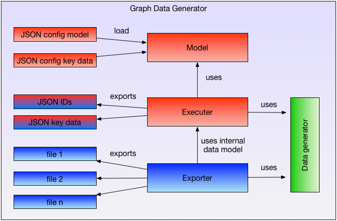

= Test Data Generator

The idea behind the Test Data Generator is to create test data in a kind of graph format.
Most applications needs test data which is related to each other.
For example for a test a set of employee data is needed. Then the employee should
have accounts. An account belongs to an application. An employee has a manager.
One manager must not have more than 100 employees.

This description could be enhanced and enhanced. In a very short time a graph of relations
is created.

This TDG should create data which fulfill these requirements. Created test data which
is related in a predefined structure.

Also it should be able to create mass data used for load tests. The current quantity structure
this TDG is created for is about:

.Quantity structure this TDG is made for
----
     4.000 Applications
 3.000.000 Accounts
 1.000.000 Entitlements
20.000.000 relations between Accounts and entitlements
   700.000 employees
           ...
----

In an first step only edges with IDs will be created. These edges defines the Graph.
The second step is to create the fields which are used to connect the data in real life.
For example the employee may have a unique user id in specific format. And the account
has an owner field which contains this id.
So first create all the necessary IDs and enrich the already created edges with this data.

Then separate data files in the applications specific format may be created containing
only the ID values.

== Overview

The following image shows the base components of the data generator

.Component Overview

.Component interaction

:leveloffset: 1

include::./main.adoc[]

:leveloffset: - 1

== Configuration

:leveloffset: 1

include::./config-model.adoc[]

include::./config-key-data.adoc[]

include::./config-exporter.adoc[]

:leveloffset: - 1

== Model and key data

:leveloffset: 1

include::./tdg-model.adoc[]

include::./tdg-executer-data.adoc[]

include::./tdg-writer.adoc[]

:leveloffset: - 1

== Data generators

:leveloffset: 1

include::./tdg-generator-dispatcher.adoc[]

include::./tdg-generator-modules.adoc[]

:leveloffset: - 1

== Exporter

:leveloffset: 1

include::./tdg-exporter.adoc[]

include::./tdg-exporter-modules.adoc[]

:leveloffset: - 1
