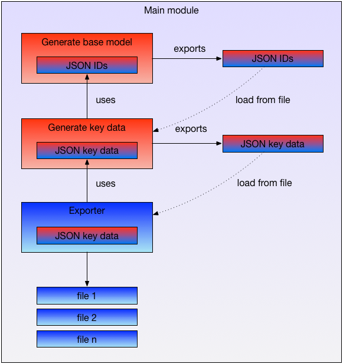

== TDG Executer Data
 The main module is the module to use the generator.

=== Usage of the generator

.Usage
[source, js]
----

// get the main module
const tdg = require('graph-data-generator').main; <1>

// add the custom functions to the TDG
tdg.addCustomFunctions(customTdgFunctions);       <2>
tdg.addCustomGenerator(customDataGenerator);      <2>
tdg.addCustomExporter(customExporter);            <2>
tdg.addCustomExporterWriter(customExpWriter);     <2>

//tdg.use(function);
tdg.run({
  "config_file": configFile,                      <3>
  "config_file_key_data": configFileKeyData,      <4>
  "config_file_exporter": configFileExporter,     <5>
  "target_dir": targetDir                         <6>
});
----
<1> Get the main module of the generator.
<2> Add custom functions/generators/exporter. Only if you need any.
<3> The configuration file of the graph data generator
<4> The configuration file of how to generate the key data
<5> The exporter configuration defines how to export the data

The following figure shows how the modules are called. After each step the generated data will
be exported. So the process could be restarted from this point on. Is is an important feature
for large amount of data where the generation may took minutes or hours.

.Component Overview

*Example: Start with generating the key data. Skip the first step*

.Usage
[source, js]
----

// get the main module
const tdg = require('graph-data-generator').main;

// add the custom functions to the TDG
// tdg.addCustomFunctions(customTdgFunctions);    <1>
tdg.addCustomGenerator(customDataGenerator);
tdg.addCustomExporter(customExporter);
tdg.addCustomExporterWriter(customExpWriter);

// Loads the already generated data. So we can start with the
// second step
tdg.createRegistry(targetDir, [
	"Edge_account_has_entitlement.json",
	"Edge_application_has_account.json",
	"Vertex_account.json",
	"Vertex_entitlement.json",
	"Edge_account_identity.json",
	"Edge_application_has_entitlement.json",
	"Vertex_application.json",
	"Vertex_identity.json"
]);

//tdg.use(function);
tdg.run({
  // "config_file": configFile,                   <2>
  "config_file_key_data": configFileKeyData,
  "config_file_exporter": configFileExporter,
  "target_dir": targetDir
});
----
<1> Not needed. We would like to start with the second step
<2> Needs to be undefined, so the run method "knows" that it should start with the second step

=== Functions

==== addCustomFunctions
Adds all the functions given in the object to the available custom functions.
These function are used when creating the graph. See "config-model" for more on this.

.Parameter
[source, js]
----
{
  "func_name" : function
}
----

==== addCustomGenerator
Adds a custom data generator. These generators could be used to create the data
for the key values and/or when exporting the data.

.Parameter
[source, js]
----
{
  "generator_name" : generator
}
----

==== addCustomExporter
Adds a custom exporter.

.Parameter
[source, js]
----
{
  "exporter_name" : exporter
}
----

==== addCustomExporterWriter
Adds a custom exporter writer. These writer are used by the default exporter.

.Parameter
[source, js]
----
{
  "exporter_writer_name" : exporterWriter
}
----
